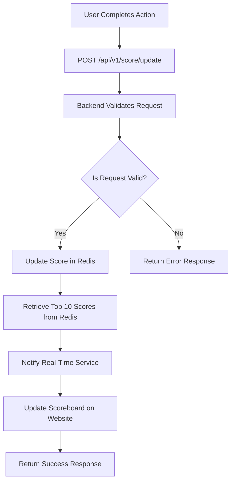

# Scoreboard API Service

## Overview

This module provides an API service for managing and updating user scores on a scoreboard using Redis for real-time leaderboard management. It supports live updates of the scoreboard and ensures secure score updates to prevent unauthorized modifications.

## Features

1. **Live Scoreboard Updates**: The scoreboard displays the top 10 user scores and updates in real-time.
2. **Score Update API**: Users can increase their scores by performing certain actions, which trigger an API call to update the score.
3. **Leaderboard Retrieval API**: Retrieve the top 10 user scores.
4. **Security**: Prevents unauthorized score modifications through authentication and validation mechanisms.

## API Endpoints

### 1. Update Score

- **Endpoint**: `/api/v1/score/update`
- **Method**: `POST`
- **Description**: Updates the user's score upon completing an action.
- **Request Body**:
  ```json
  {
    "userId": "string",
    "scoreIncrement": "number",
    "authToken": "string"
  }
  ```
- **Response**:
200 OK: Score updated successfully.
400 Bad Request: Invalid request data.
401 Unauthorized: Authentication failed.
500 Internal Server Error: Server error.

### 2. Get Leaderboard

- **Endpoint**: `/api/v1/leaderboard`
- **Method**: `GET`
- **Description**: Retrieves the top 10 user scores.
- **Response**:
200 OK: Returns the top 10 user scores.
500 Internal Server Error: Server error.

### Authentication
Auth Middleware: Validates the authToken provided in the request the user is authorized to update the score.

## Data models

### Users

| Fields      | Type      | Note |
|--------------|-----------|-------------------------------|
| _id           |  ObjectId     | Unique identifier for the user |
| username     | String    | Username of user to show on leaderboard  |
| score        | Integer   | Current score of the user |

## Flow of Execution
1. User completes an action on the website.
2. The website dispatches a POST request to /api/v1/score/update with the user's userId, scoreIncrement, and authToken.
3. The API server validates the authToken.
4. If valid, the server updates the user's score in Redis.
5. The server retrieves the top 10 scores from Redis.
6. The server notifies a real-time service (e.g., WebSocket server) to update the scoreboard on the website.
7. The server responds to the client with the status of the update.

## Diagram
You can use [this](https://mermaid.live/) for view the flow of execution if the diagram is not displayed



## Additional notes
1. **Rate Limiting**: Implement rate limiting to prevent abuse of the score update endpoint.
2. **Security**: Ensure the `authToken` validation logic is secure.
3. **Caching**: Use caching strategy to reduce load when retrieving the top 10 scores.
4. **Detailed Logging**: Add detailed logging for monitoring and debugging purposes.
5. **Unit Tests**: Write unit tests for the API endpoints, authentication middleware, and score update logic.
6. **WebSockets**: Consider using WebSockets for real-time updates instead of polling.

### I’m open to your feedback and suggestions for improvement! Please feel free to discuss potential solutions email me at dangtuanduong99@gmail.com. 🍀🧧